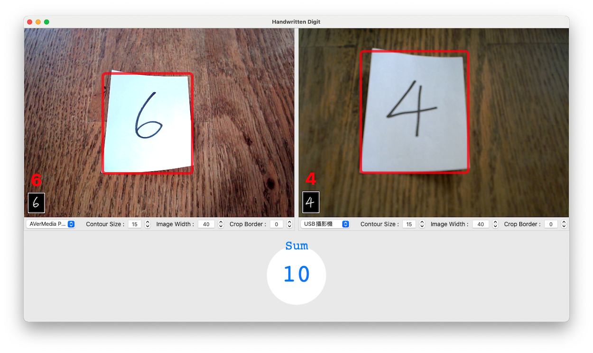
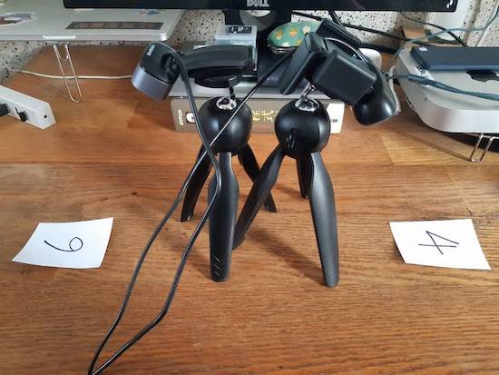
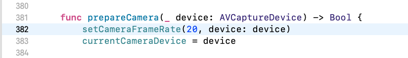

# Detect Handwritten Digit Demo App for macOS

- 使用 AV Foundation 存取 Webcam。
- 使用 Vision Framework 檢測矩形與輪廓。
- 使用 MNIST 檢測手寫數字。

 

## 示範影片

- [Demo Video](https://youtu.be/h9oJNLhc1s8)

## 程式擷圖

## 限制

- 只能檢測單一手寫數字 (0~9)。

## 需求

- 兩個 Webcam (我用的 Webcam 型號分別是：`圓剛 PW310O` 與 `羅技 C270`)。
- 一疊便條紙。
- 一隻奇異筆 (不要太細)。

## 思路說明

1. 先用 VNDetectRectanglesRequest 檢測畫面中的矩形，並取最大的矩形。
2. 然後把矩形裡的圖像做`透視校正`(Perspective Correction)，把紙張圖像拉正。
3. 接著用`高斯模糊` (Gaussian Blur) 幫圖像降噪。
4. 接著用 VNDetectContoursRequest 抓取圖像的`輪廓`。
5. 接著把輪廓畫成`黑白圖像` (輪廓是白色，底圖為黑色)。
6. 最後把圖像縮小，再傳給 MNIST 模型做推斷。

## 注意事項

1. Webcam 用腳架架著比較好，用手拿會晃動，如果 Webcam 畫質不佳的話，用手拿著時畫面會更糊，數字的輪廓可能會抓不完整。
2. 考量到鏡頭畫質、房間光線、奇異筆粗細、手寫數字大小等因素影響，所以我加了`Contour Size`、`Image Width`、`Crop Border`等 Stepper 來調整輪廓的黑白圖像，可視情況調整之。（注意：MNIST 的訓練資料集是 28x28 像素的圖像）
3. 考量到效能問題，我限制 Webcam 的 Frame Rate 為 `20`。不過，如果你的 Webcam 不支援這個 Frame Rate，那就會使用 Webcam 本身預設的 Frame Rate。 如果你的 Mac 速度很快，不想限制 Frame Rate，可以把 `setCameraFrameRate(20, device: device)` 這行註解掉。

　（Webcam 支援的 Frame Rate 可以用 AVCaptureDevice.activeFormat.videoSupportedFrameRateRanges 查看）

## 模型來源

- MNIST 模型是使用 Apple Inc. 提供的 [MNISTClassifier.mlmodel](https://developer.apple.com/machine-learning/models/)。

